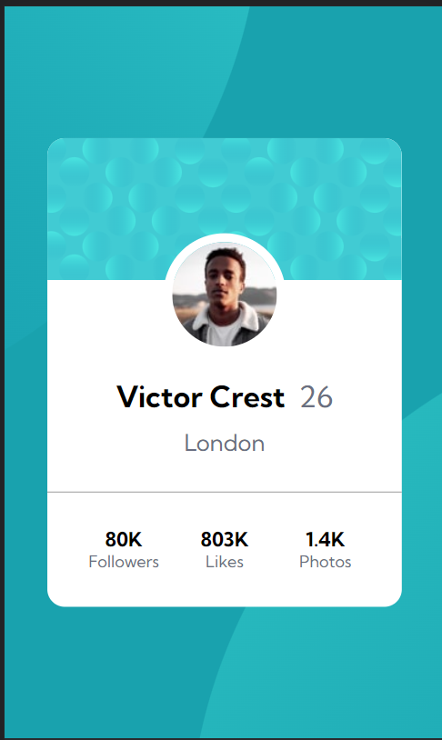

# Frontend Mentor - Profile card component solution

This is a solution to the [Profile card component challenge on Frontend Mentor](https://www.frontendmentor.io/challenges/profile-card-component-cfArpWshJ). Frontend Mentor challenges help you improve your coding skills by building realistic projects.

## Table of contents

- [The challenge](#the-challenge)
- [My process](#my-process)
  - [Built with](#built-with)
  - [What I learned](#what-i-learned)
  - [Continued development](#continued-development)
  - [Useful resources](#useful-resources)
- [Author](#author)
- [Acknowledgments](#acknowledgments)

### The challenge

- Build out the project to the designs provided

### Screenshot




- Solution URL: [Add solution URL here](https://github.com/joud-s/Profile-card-component)
- Live Site URL: [Add live site URL here](https://your-live-site-url.com)

## My process

### Built with

- Semantic HTML5 markup
- CSS custom properties
- Flexbox
- CSS Grid
- Mobile-first workflow

### What I learned

-to put the image on top of the pattren i first used (position: relaitve) and (top :- 3rem)
but i reilazed the text go way down so i change it to (margin-top :-3rem) and that fix the problem
-the number and the details wasint on top of each other so i changed the html by put each number and name on the same groub
-i used (flex : 1) for the first time its a great way to space the element awy from each other

To see how you can add code snippets, see below:

```html
<div class="details">
  <h4>80K</h4>
  <h5>Followers</h5>
  <h4>803K</h4>
  <h5>Likes</h5>
  <h4>1.4K</h4>
  <h5>Photos</h5>
</div>
-------------to fix the problem
<div class="details">
  <div class="row">
    <h4>80K</h4>
    <h5>Followers</h5>
  </div>
  <div class="row">
    <h4>803K</h4>
    <h5>Likes</h5>
  </div>
  <div class="row">
    <h4>1.4K</h4>
    <h5>Photos</h5>
  </div>
</div>
```

to prevent the circle overflow

```css
.main {
  overflow: hidden;
}
```

## Author

- Website - [Add your name here](https://www.your-site.com)
- Frontend Mentor - [@yourusername](https://www.frontendmentor.io/profile/yourusername)
- Twitter - [@yourusername](https://www.twitter.com/yourusername)
